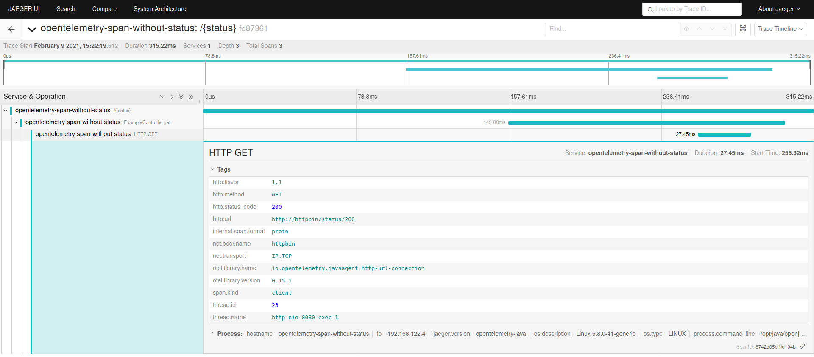
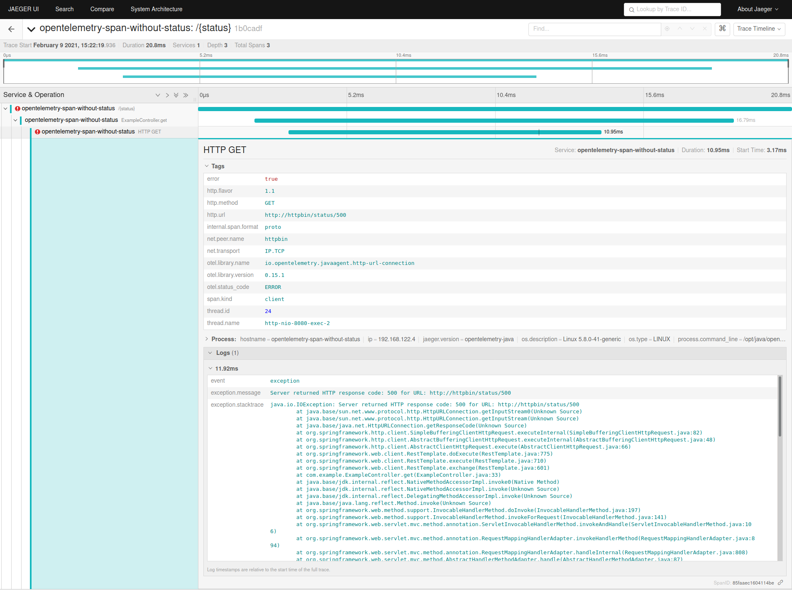

# Spans without status attribute created by http-url-connection instrumentation

## Description

Spans for HTTP calls made using `HttpURLConnection` or a client like `RestTemplate` from Spring Boot, which uses it, have no `http.status_code` attribute on errors with response status 4xx and 5xx. If a response has status 1xx, 2xx or 3xx the attribute is present.

| **Status 1xx, 2xx and 3xx**          | **Status 4xx and 5xx**               |
| ------------------------------------ | ------------------------------------ |
|  |  |

## Steps to reproduce

1. Build the project with `mvn clean package`.
2. Start the service, httpbin and jaeger using `docker-compose up -d` and wait until all components are started.
3. Call `./calls.sh` script to perform some HTTP calls to the service.
4. Take a look at traces in jaeger UI - [http://localhost:16686](http://localhost:16686).
5. Stop all components using `docker-compose down`.
